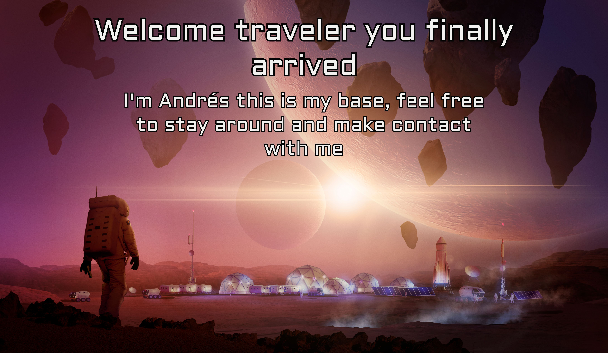

## Glad that you are here, i'm Andrés another voyager exploring this wonderful world striving to go beyond !!

- 🧑🏼‍🚀Hi, I’m @AdrsP Full Stack Software Developer
- 🔭 I’m interested in science and making new things that would help to develop the world.
- 🛰️ I’m currently learning more about Back End Development and APIs
- 👯 I’m looking to collaborate with other enthusiast.
- ☄️ Fun fact: By the laws of thermodynamics the entropy of the universe just keeps growing this means,
  that everything is irreversible so dont go around beliving you can undo things, so take great consideration
  when chosing what to do in your life, explore a little, but try to do not mess around too much.
- 🌠 2024 Goals: Keep growing in the wonderful world of web development.

### Connect with me:

&nbsp;&nbsp;

### Languages and Tools:

 

<!---
AdrsP/AdrsP is a ✨ special ✨ repository because its `README.md` (this file) appears on your GitHub profile.
You can click the Preview link to take a look at your changes.
--->
